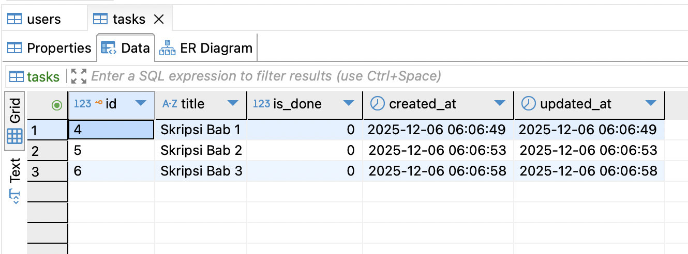
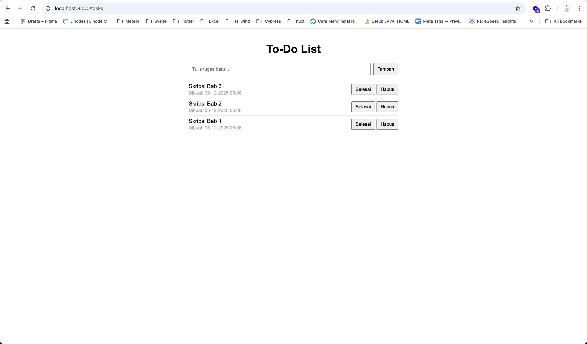
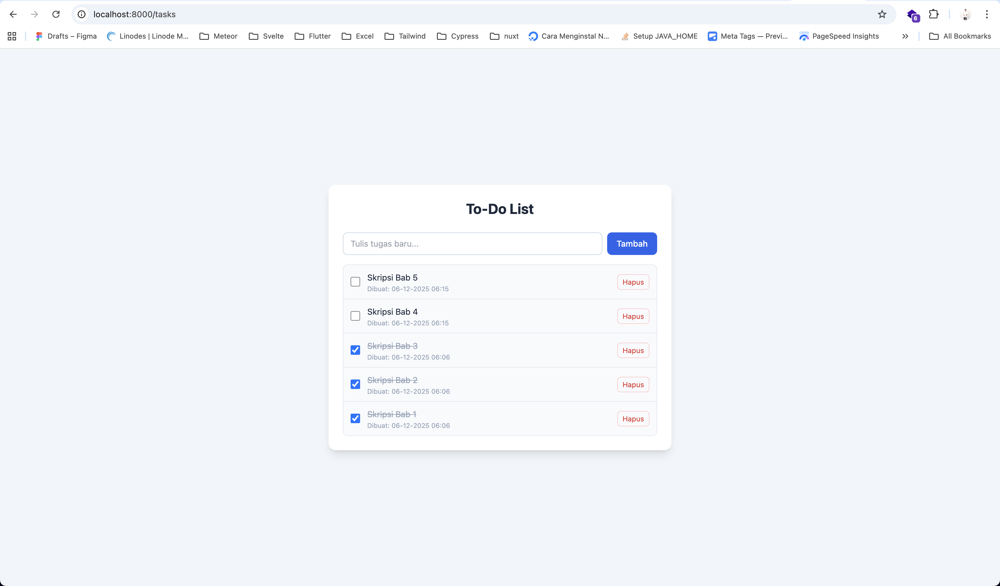
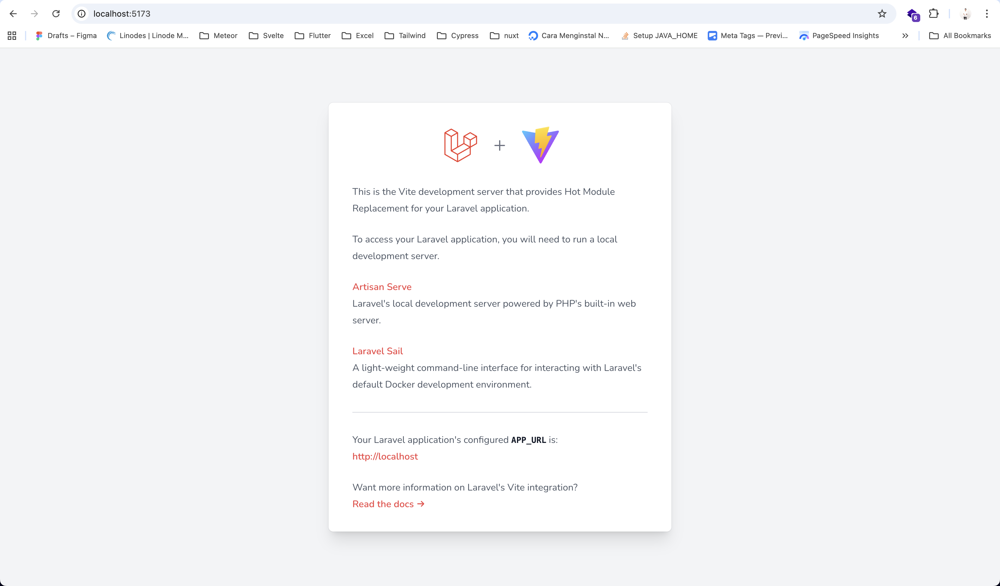

## Kelompok Pekerjaan 1

- Melakukan instalasi software tools

## Kelompok Pekerjaan 2

- Mengimplementasikan user interface
- Menggunakan struktur data
- Mengimplementasikan pemrograman terstruktur

## Kelompok Pekerjaan 3

- Menggunakan library atau komponen pre-existing
- Menulis kode dengan prinsip sesuai guidelines dan best practices

## Kelompok Pekerjaan 4

- Melakukan debugging

## Kelompok Pekerjaan 5

- Membuat dokumentasi program

## Info
1. Harus menyalakan laravel - vite dengan command: npm run dev
2. Nyalakan project to-do app dengan command: php artisan serve
